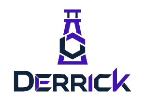

<p align="center">
  <table align="center">
    <tr>
      <td bgcolor="white" align="center">
        
      </td>
    </tr>
  </table>
</p>

<h1 align="center">Derrick CLI</h1>

<p align="center">
  <a href="https://opensource.org/licenses/MIT"></a>
  <a href="https://goreportcard.com/report/github.com/Salv4d/derrick"></a>
  
</p>

<p align="center">
  <strong>Derrick</strong> is a professional-grade local development orchestrator designed for complex microservice environments. It acts as a <strong>smart control plane</strong> that unites the absolute reproducibility of <strong>Nix</strong> with the containerization of <strong>Docker Compose</strong>, wrapped in a rigorous state validation system.
</p>

---

Unlike generic task runners, Derrick ensures that every contributor's machine is a bit-for-bit clone of the production-grade toolchain, without ever polluting the host OS.

---

## 🚀 The Core Philosophy

1.  **Zero Host Pollution:** No more `nvm`, `pyenv`, or `gvm`. All compilers, runtimes, and libraries live strictly inside an isolated Nix sandbox.
2.  **Declarative Contracts:** Your environment is defined in `derrick.yaml`. If the contract says you need Go 1.21 and a specific Postgres extension, Derrick guarantees you have them before the first line of code runs.
3.  **Fail-Fast Validation:** Derrick audits your local state (secrets, network, dependencies) in milliseconds. If a requirement is missing, it provides interactive, self-healing prompts instead of cryptic stack traces.
4.  **Surgical Persistence:** Interactive configuration of `.env` files with support for default values and shell-based validation (e.g., verifying a GitHub token via `curl` before saving it).

---

## 🛠 Features

### 📦 Unified Sandbox (Nix + Docker)
Derrick orchestrates your **tooling** (via Nix) and your **services** (via Docker Compose) simultaneously.
*   **Nix Sandbox:** Version-locked binaries (`node`, `go`, `redis-cli`) available via `derrick shell`.
*   **Docker Orchestration:** Native lifecycle management of containers with built-in health checks.

### 🛡 Rigorous Environment Validation
Define an `env` block in your `derrick.yaml` to enforce security and connectivity:
*   **Interactive Prompts:** Missing secrets? Derrick securely asks for them.
*   **Default Values:** Sensible defaults for non-sensitive data.
*   **Live Validation:** Run shell commands (like `ping` or `api calls`) to verify that the provided secret actually works.

### ⚡ Lifecycle Hooks
Execute bash scripts at critical junctions:
*   `pre_init` / `post_init`: Seed databases or download private modules.
*   `pre_start` / `post_start`: Run migrations once the environment is healthy.

---

## 📥 Installation

```bash
# Clone the repository
git clone https://github.com/Salv4d/derrick.git
cd derrick

# Build and install
go build -o derrick ./cmd/derrick
sudo mv derrick /usr/local/bin/
```

*Note: Requires [Nix](https://nixos.org/download.html) and [Docker](https://docs.docker.com/engine/install/) to be installed on the host.*

---

## 📖 Quick Start

1.  **Initialize your project:** Create a `derrick.yaml` in your root directory.
2.  **Start the environment:**
    ```bash
    derrick start
    ```
3.  **Enter the sandbox:**
    ```bash
    derrick shell
    ```
4.  **Audit your health:**
    ```bash
    derrick doctor
    ```

### Example `derrick.yaml`
```yaml
name: "my-microservice"
version: "1.0.0"

dependencies:
  nix_packages:
    - "go_1_21"
    - "postgresql_15"
  docker_compose: "docker-compose.yml"

env:
  GITHUB_TOKEN:
    description: "Token for private module access"
    required: true
    validation: "curl -s --fail -H \"Authorization: token $GITHUB_TOKEN\" https://api.github.com/notifications"
  DB_PASSWORD:
    description: "Local DB password"
    default: "postgres"

validations:
  - name: "Port 8080 Availability"
    command: "! lsof -i :8080"
```

---

## 🚧 Status & Roadmap

Derrick is currently in **Alpha**. It is stable for Linux/WSL environments.

- [x] Nix + Docker Compose Orchestration
- [x] Interactive Environment Validation & `.env` Replacement
- [x] Custom Config Support (`-f` flag)
- [ ] **Project Clustering:** Cross-directory service discovery and networking.
- [ ] **Remote Config Extensions:** Inherit base configurations from remote URLs.
- [ ] **TUI Dashboard:** A live BubbleTea-powered container and log viewer.

---

## 🤝 Contributing

We welcome contributions! Please see our [Benchmark Projects](.derrick/benchmark_projects.md) to see how we are testing Derrick against production-grade environments.

1. Fork the repo.
2. Create your feature branch (`git checkout -b feature/amazing-feature`).
3. Commit your changes (`git commit -m 'feat: add some amazing feature'`).
4. Push to the branch (`git push origin feature/amazing-feature`).
5. Open a Pull Request.

---

## 📄 License

Distributed under the MIT License. See `LICENSE` for more information.
