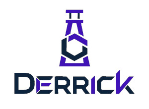

<p align="center">
  
</p>

<h1 align="center">Derrick</h1>

<p align="center">
  <strong>One file. One command. A working dev environment — for every teammate, every laptop, every time.</strong>
</p>

<p align="center">
  <a href="https://salv4d.github.io/derrick/"></a>
  <a href="https://github.com/Salv4d/derrick/releases/latest"></a>
  <a href="https://github.com/Salv4d/derrick/actions/workflows/ci.yml"></a>
  <a href="https://goreportcard.com/report/github.com/Salv4d/derrick"></a>
  <a href="https://opensource.org/licenses/MIT"></a>
</p>

---

## What Derrick is

Derrick is a local dev-environment orchestrator. You describe what your project needs in a `derrick.yaml` — language toolchain, containerized services, setup hooks — and a single `derrick start` boots the whole thing, the same way, on every machine.

Under the hood it wraps **Nix** (for reproducible language toolchains without polluting your host OS) and **Docker Compose** (for services like Postgres, Redis, ClickHouse). You can use either alone, or compose them with `provider: hybrid`.

## See it work

```yaml
# derrick.yaml
name: my-api
version: 0.1.0
provider: hybrid

nix:
  packages: [go_1_22, nodejs_22]

docker:
  compose: ./docker-compose.yml

hooks:
  setup:
    - run: "go mod download"
      when: first-setup
```

```bash
derrick start   # pulls toolchain, runs setup hooks, starts containers, runs after_start
derrick shell   # drops you into the sealed environment
# inside: go and node are on PATH — Postgres and Redis are on host.docker.internal
```

No `nvm`. No `pyenv`. No "works on my machine".

## Install

```bash
curl -fsSL https://raw.githubusercontent.com/Salv4d/derrick/main/install.sh | bash
```

Other options (Nix flake, Go install, pre-built binary, build from source) → [Installation guide](./website/docs/installation.md).

## Where to go next

| If you want to… | Start here |
| :--- | :--- |
| See Derrick running in 3 minutes | [Getting Started tutorial](./website/docs/getting_started.md) |
| Understand how it compares to mise, devcontainers, devenv.sh | [Why Derrick?](./website/docs/why_derrick.md) |
| Copy a working config for a real microservices project | [Recipes / Use Cases](./website/docs/use_cases/) |
| Look up a command or `derrick.yaml` field | [CLI & Config Reference](./website/docs/api_reference.md) |
| Learn the Provider / State / Hooks model | [Architecture](./website/docs/architecture.md) |
| Debug a broken start | [Troubleshooting](./website/docs/troubleshooting.md) |
| Hack on Derrick itself | [Contributing Guide](./website/docs/contributing.md) |

Full docs site: **[salv4d.github.io/derrick](https://salv4d.github.io/derrick/)**

## Status

Derrick is currently **alpha**. Pre-built binaries exist for linux/amd64, linux/arm64, darwin/amd64, and darwin/arm64. The CLI is daily-driver stable on Linux, WSL2, and macOS; Windows-native is not supported yet (use WSL2).

Tracked on the roadmap:
- Remote config extensions (inherit `derrick.yaml` bases from signed URLs)
- Cloud workspace provisioning (sync local sandbox to remote VMs)
- First-class Podman / nerdctl backend

## Contributing

PRs welcome. Start with the [Contributing Guide](./website/docs/contributing.md) — it covers local dev (`derrick shell` bootstraps the Go toolchain itself), the test suite, and how to add a new provider backend.

## License

MIT — see [LICENSE](./LICENSE).
