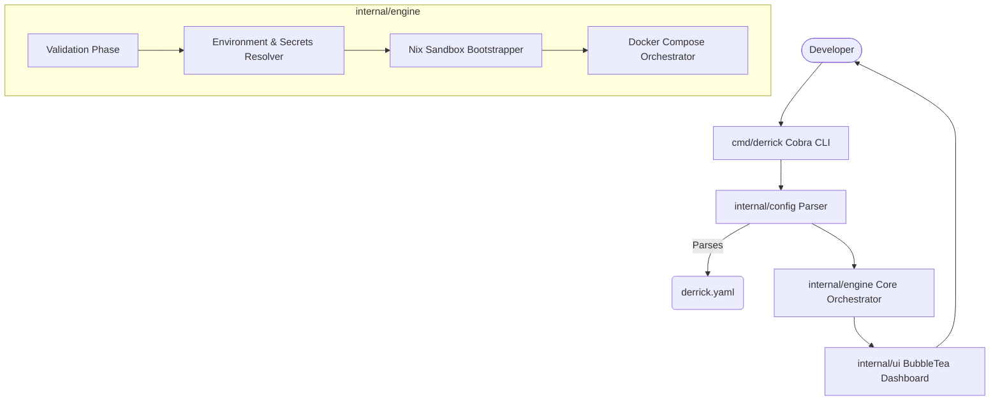

# 🏗 Architecture & System Design

Derrick is designed as a strict state-enforcement pipeline. The core philosophy is that an environment should only start if all preconditions are structurally verified.

## High-Level Topology

## The Engine (`internal/engine`)

The `engine` is the undeniable **heart** of the project. It conducts the orchestration lifecycle:

1. **Validation (`validation.go`)**: Runs heuristic checks (like port availability, CLI presence) defined in the configuration.
2. **Environment Resolver (`env.go`)**: Verifies required environment variables via interactive prompts or bash execution, avoiding `.env` mismanagement.
3. **Nix Controller (`nix.go`)**: Summons `nix-shell` to lazily pull strictly versioned binaries (e.g., node, go) into an ephemeral boundary.
4. **Docker Controller (`docker.go`)**: Spins up complementary sidecars via `docker-compose`. 

## The UI (`internal/ui`)

Driven by the `charmbracelet` ecosystem (`huh` for prompts, `lipgloss` for styling, and `bubbletea` for interactivity), providing developers robust, real-time feedback over their environment.
