# CLI Reference & `derrick.yaml` Spec

This guide covers the complete Derrick CLI surface and every field in `derrick.yaml`.

---

## Command Line Interface

| Command | Description |
| :--- | :--- |
| `start [alias]` | Resolve the provider, run lifecycle hooks, and boot the environment. An optional alias clones and starts a Hub-registered project. |
| `stop` | Run stop hooks and tear down the environment gracefully. |
| `shell [-- cmd…]` | Open an interactive shell in the active environment, or run a one-shot command when args follow `--`. Routes to the active provider (docker `compose exec`, nix `nix develop --command`). |
| `run [packages...] [-- cmd]` | Spawn a throwaway Nix environment with ad-hoc packages. |
| `init` | Interactive wizard that generates `derrick.yaml` for a new project. |
| `doctor` | Audit the environment against `derrick.yaml` without booting it. Exits non-zero when issues are found (gates CI). |
| `status` | Print the current project's runtime state (provider, hooks, env files). |
| `clean` | Garbage-collect orphaned Nix derivatives and Docker resources labelled `com.derrick.managed=true`. |
| `completion [shell]` | Emit shell completion script for `bash`, `zsh`, `fish`, or `powershell`. Activation instructions are in the long help. |
| `update` | Replace the local binary with the latest GitHub release. |
| `version` | Print version and check for updates. |

### Global flags

| Flag | Description |
| :--- | :--- |
| `--debug` | Stream raw subprocess output and verbose diagnostics. |
| `-f, --file` | Custom config file path (default: `derrick.yaml`). |
| `-p, --profile` | Named profile to activate (see Profiles below). |

### Machine-readable output

`status`, `doctor`, and `version` accept `--json` for scripting. When combined with `doctor`'s non-zero exit on issues, you can gate CI on environment health without parsing text output.

### `start` flags

| Flag | Description |
| :--- | :--- |
| `--reset` | Signal providers and hooks to rebuild from scratch. |
| `--flag <name>` | Activate a custom project flag (can be repeated). Enables `when: flag:<name>` hooks. |
| `--dry-run` | Print the provider actions and hooks that would run, without mutating state or starting anything. Also supported by `clean`. |

---

## `derrick.yaml` Reference

### Top-level metadata

| Field | Type | Required | Description |
| :--- | :--- | :--- | :--- |
| `name` | `string` | **Yes** | Project name. Must be lowercase. |
| `version` | `string` | **Yes** | Project version string. |
| `provider` | `string` | No | Isolation backend: `docker`, `nix`, `hybrid`, or `auto` (default). `auto` picks Docker when a compose file is present, otherwise Nix. `hybrid` composes both: containers for services, nix for the language toolchain. |
| `requires` | `[]string` or `[]object` | No | Sibling projects that must be running first. See the [`requires` block](#requires-block) below. |

```yaml
name: "my-api"
version: "1.0.0"
provider: docker
```

---

### `docker` block

Used when `provider` is `docker` or `auto`.

| Field | Type | Description |
| :--- | :--- | :--- |
| `docker.compose` | `string` | Path to the Docker Compose file. |
| `docker.profiles` | `[]string` | Compose profiles to activate. |
| `docker.shell` | `string` | Service to exec into for `derrick shell`. Defaults to the first service in the compose file. |
| `docker.networks` | `[]string` | External Docker networks every service in this project joins. Derrick creates any missing networks on first start (labelled `com.derrick.managed=true`) and injects them into the generated override. Use this to opt into cross-project container DNS without giving up per-project isolation by default. |

```yaml
docker:
  compose: ./docker-compose.yml
  profiles: [dev, worker]
  shell: app
  networks:
    - shared-infra   # also declared by a sibling project → they can resolve each other by service name
```

---

### `nix` block

Used when `provider` is `nix` or `auto`.

| Field | Type | Description |
| :--- | :--- | :--- |
| `nix.registry` | `string` | Nixpkgs flake input URL (default: `github:NixOS/nixpkgs/nixos-unstable`). |
| `nix.packages` | `[]string` or `[]object` | Packages to install. A plain string resolves from the default registry; `{package, registry}` allows per-package overrides. |

```yaml
nix:
  registry: "github:NixOS/nixpkgs/nixos-unstable"
  packages:
    - "go"
    - "nodejs_22"
    - package: "legacy_tool"
      registry: "github:NixOS/nixpkgs/nixos-22.11"
```

---

### `hooks` block

Lifecycle hooks are lists of commands run at each stage. Each entry is either a plain string (runs always) or a structured object with an optional `when:` condition.

Stages are split by *when the environment is ready* and *where the command runs*. Host-stage hooks see your bare shell; sandbox-stage hooks are wrapped in `nix develop` when Nix is active so the language toolchain is on PATH.

```mermaid
flowchart LR
    A([derrick start]) --> B[before_start<br/><i>host</i>]
    B --> C[Provision<br/>flake / override]
    C --> D[setup<br/><i>sandbox, no services</i>]
    D --> E[Start<br/>compose up]
    E --> F[after_start<br/><i>sandbox + services</i>]
    F --> G([running])
    G --> H([derrick stop])
    H --> I[before_stop<br/><i>sandbox + services</i>]
    I --> J[Stop<br/>compose down]
    J --> K[after_stop<br/><i>host</i>]
    K --> L([stopped])
```



| Hook stage | Timing | Shell |
| :--- | :--- | :--- |
| `hooks.before_start` | Before provisioning. Use for preconditions or input generation. | host |
| `hooks.setup` | After the sandbox is materialized but before services boot. Use for `npm install`, `go mod download`, build steps. | sandbox |
| `hooks.after_start` | After services are running. Use for DB seeding, warmup, fixtures. | sandbox |
| `hooks.before_stop` | During `derrick stop`, while services are still reachable. Use for graceful drain, DB dumps. | sandbox |
| `hooks.after_stop` | After teardown. Use for log shipping or host-level cleanup. | host |

#### `when:` conditions

| Value | Fires when... |
| :--- | :--- |
| `always` (default) | Every invocation. |
| `first-setup` | Only on the very first successful `derrick start`. Use for one-time setup: migrations, dependency installs, seed data. |
| `flag:<name>` | Only when `--flag <name>` is passed to `derrick start`. |

```yaml
hooks:
  before_start:
    - run: "test -f .env || cp .env.example .env"
      when: always
  setup:
    - run: "go mod download && make migrate"
      when: first-setup
    - run: "go build ./..."
      when: always
  after_start:
    - run: "make seed-db"
      when: flag:seed-db
  before_stop:
    - run: "pg_dump > .derrick/last.sql"
      when: always
  after_stop:
    - run: "make cleanup"
      when: always
```

---

### `flags` block

Declare custom project flags. They appear in `derrick start --help` and gate `when: flag:<name>` hooks.

```yaml
flags:
  reset:
    description: "Rebuild the environment and replay migrations from scratch"
  seed-db:
    description: "Inject initial seed data after the environment boots"
```

Usage:
```bash
derrick start --flag seed-db
derrick start --flag reset --flag seed-db
```

---

### `env` block

Declare environment variables the project requires. Derrick validates them at startup and interactively prompts for missing ones.

| Field | Type | Description |
| :--- | :--- | :--- |
| `env.<KEY>.description` | `string` | Shown when prompting the developer. |
| `env.<KEY>.required` | `bool` | Fail-fast if the variable is missing and has no default. |
| `env.<KEY>.default` | `string` | Value injected when the variable is absent. |
| `env.<KEY>.validation` | `string` | Shell command. Non-zero exit triggers an interactive resolution flow. |

```yaml
env:
  DATABASE_URL:
    description: "PostgreSQL connection string"
    required: true
    default: "postgres://localhost:5432/myapp_dev"
  STRIPE_SECRET_KEY:
    required: true
    validation: "curl -sf -H 'Authorization: Bearer $STRIPE_SECRET_KEY' https://api.stripe.com/v1/balance"
```

---

### `env_management` block

| Field | Type | Description |
| :--- | :--- | :--- |
| `env_management.base_file` | `string` | Template file (e.g. `.env.example`) auto-copied to `.env` when absent. |
| `env_management.prompt_missing` | `bool` | Interactively prompt for any empty variables in the env file. |

```yaml
env_management:
  base_file: ".env.example"
  prompt_missing: true
```

---

### `validations` block

Arbitrary shell assertions run before the environment boots.

| Field | Type | Description |
| :--- | :--- | :--- |
| `validations[].name` | `string` | Human-readable check name. |
| `validations[].command` | `string` | Shell command. Non-zero exit = failure. |
| `validations[].auto_fix` | `string` | Shell command run automatically on failure, then re-checked. |

```yaml
validations:
  - name: "Port 8080 is free"
    command: "! lsof -i :8080"
    auto_fix: "kill -9 $(lsof -t -i:8080)"
  - name: "Go compiler"
    command: "go version"
```

---

### `requires` block

Declare sibling projects that must be running before this one. Derrick resolves each name via the Hub (`~/.derrick/config.yaml`), clones if needed, and runs `derrick start` in the dependency's directory before continuing with the current project.

Each entry can be a plain string (shorthand for `{name: <x>, connect: true}`) or a full object.

| Field | Type | Default | Description |
| :--- | :--- | :--- | :--- |
| `requires[].name` | `string` | — | Sibling directory name, matching the Hub alias. |
| `requires[].connect` | `bool` | `true` | When `true`, Derrick creates a shared network `derrick-<this-project>` and attaches both this project and the dependency to it, so containers can resolve each other by service name. Set `false` when the dependency only needs to be booted (e.g. a standalone CLI service reachable over `host.docker.internal`). |

```yaml
# Plain string — auto-connected.
requires:
  - auth-service

# Full form — mix connected and isolated dependencies.
requires:
  - name: auth-service        # shares a docker network with this project
  - name: meilisearch-dev
    connect: false            # just needs to be booted; reached via host:7700
```

Cycles are rejected at runtime: if `A` requires `B` and `B` requires `A`, `derrick start` aborts with a readable error instead of recursing. The active chain is tracked in the `DERRICK_START_CHAIN` env var across subprocesses.

---

### `profiles` block

Named overlays that extend or override the base config. Profiles can extend other profiles via `extend`.

```yaml
profiles:
  ci:
    nix:
      packages: ["golangci-lint"]
    hooks:
      after_start:
        - run: "go test ./..."
          when: always
  staging:
    extend: ci
    docker:
      profiles: [staging]
```

Activate with:
```bash
derrick start --profile staging
```

---

## Complete example

```yaml
name: "payment-service"
version: "2.1.0"
provider: docker

docker:
  compose: ./docker-compose.yml
  profiles: [dev]

nix:
  packages:
    - "go"
    - "golangci-lint"

hooks:
  setup:
    - run: "go mod download && make migrate"
      when: first-setup
  after_start:
    - run: "echo 'Starting payment-service...'"
      when: always
    - run: "make seed-db"
      when: flag:seed-db
  after_stop:
    - run: "echo 'Goodbye!'"
      when: always

flags:
  seed-db:
    description: "Populate the database with seed data"
  reset:
    description: "Drop and recreate the database schema"

requires:
  - auth-service

env:
  DATABASE_URL:
    required: true
    default: "postgres://localhost:5432/payments_dev"
  JWT_SECRET:
    required: true

validations:
  - name: "Go compiler"
    command: "go version"
  - name: "Docker daemon"
    command: "docker info"
```
