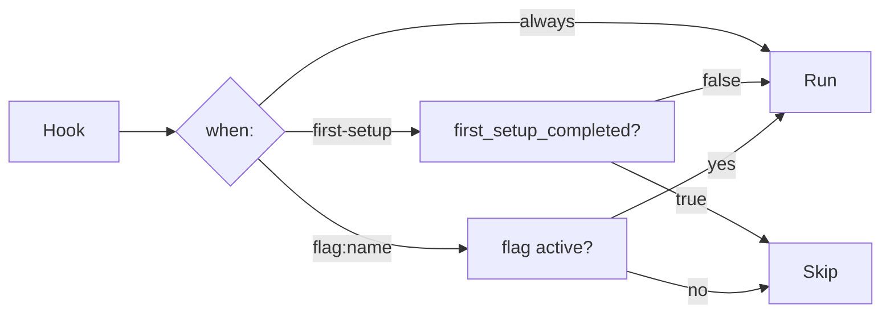

# Architecture & System Design

Derrick is a **Supreme Orchestrator**: it translates a declarative `derrick.yaml` contract into calls against proven underlying tools (Docker, Nix) without reimplementing what those tools already do well.

## High-Level Topology


## The Provider Interface

The core abstraction is a Go interface every backend implements:

```go
type Provider interface {
    Name() string
    IsAvailable() error
    Start(cfg *config.ProjectConfig, flags Flags) error
    Stop(cfg *config.ProjectConfig) error
    Shell(cfg *config.ProjectConfig) error
    Status(cfg *config.ProjectConfig) (EnvironmentStatus, error)
}
```

`ResolveProvider` reads `cfg.ActiveProvider()` and returns the right backend. The CLI layer never branches on "is this Docker or Nix" — it calls `provider.Start(...)` and the backend handles the rest. Adding a new backend (DevContainers, Podman, etc.) requires zero changes to the CLI layer.

**Why CLI wrapping instead of API SDKs?**
Both `mise` and `devcontainers-cli` (researched in Phase 1) wrap the Docker binary via `exec` rather than using the Docker Engine API SDK. This is portable (works with Podman/nerdctl), requires no version-pinned SDK binary, and enables streaming output natively. Derrick follows the same pattern.

## State Management

Derrick persists per-project runtime state in `.derrick/state.json`:

```json
{
  "project": "my-api",
  "provider": "docker",
  "status": "running",
  "first_setup_completed": true,
  "started_at": "2026-04-18T12:00:00Z",
  "flags_used": ["seed-db"]
}
```

This enables:
- **`when: first-setup` hooks** — only fire before `first_setup_completed` is set.
- **`derrick doctor`** — can compare persisted state against live Docker/Nix state to surface drift.
- **Future web dashboard** — reads state without querying Docker/Nix on every render.

## The Hook Executor

`ExecuteHooks` evaluates each hook's `when:` condition before running it:



This allows a single `hooks.start` list to encode the full lifecycle — one-time setup, every-run tasks, and on-demand operations — without separate config sections.

## Error Translation Layer

All subprocess invocations go through `internal/engine/executor.go`. On non-zero exit, `translateError` tests the raw stderr against a table of known patterns and returns a `DerrickError` with a human-readable `Fix` message:

| Pattern matched | Fix shown |
| :--- | :--- |
| `permission denied.*docker.sock` | `sudo usermod -aG docker $USER && newgrp docker` |
| `cannot connect to the docker daemon` | Start Docker Desktop or `sudo systemctl start docker` |
| `bind: address already in use` | Stop the conflicting service or adjust compose ports |
| `pull access denied` | Check image name and `docker login` |
| `attribute '...' missing` (Nix) | Check package name at search.nixos.org |

Unknown errors fall through as plain strings. No error is ever silently swallowed.

## Project Clustering & Network Topology

When `provider: docker`, Derrick:
1. Creates the `derrick-net` bridge network once (idempotent).
2. Generates a `.derrick/docker-compose.override.yml` that attaches all services to `derrick-net` and injects `host.docker.internal:host-gateway` into each container.
3. Runs `docker compose -f docker-compose.yml -f .derrick/docker-compose.override.yml up -d`.

This means containers across separate `derrick` projects resolve each other by service name with no user-facing config, and containers can reach host-native processes at `host.docker.internal`.

## Future: Web Dashboard API

The orchestrator core is a pure library (`internal/engine/`, `internal/state/`) with no stdout coupling. A future `derrick serve` command exposes the same functions over HTTP:

```
GET  /api/projects              list known projects
POST /api/projects/:id/start    start an environment
POST /api/projects/:id/stop     stop an environment
GET  /api/projects/:id/status   current status
GET  /api/projects/:id/logs     SSE log stream
```

No business logic duplication is needed — the same `Provider.Start()` call powers both the CLI and the API.
