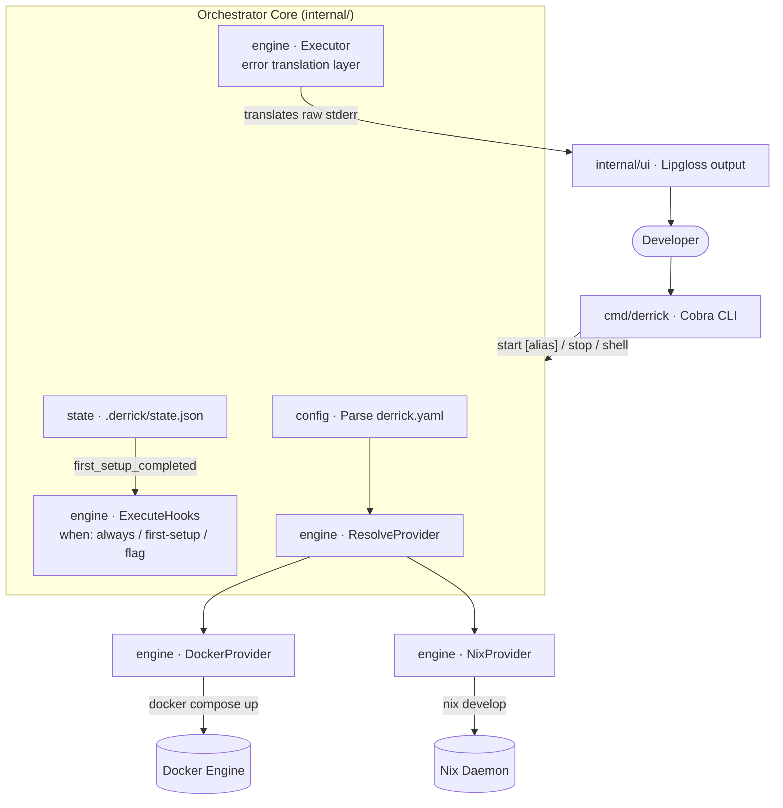
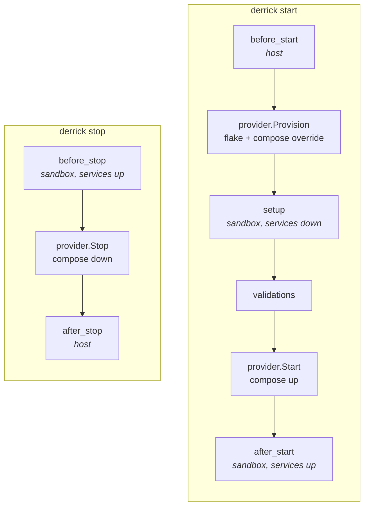
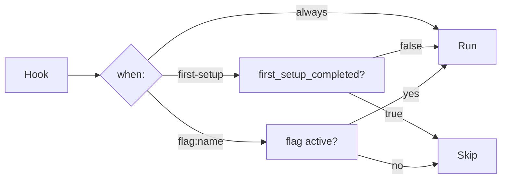

# Architecture & System Design

Derrick is a **Supreme Orchestrator**: it translates a declarative `derrick.yaml` contract into calls against proven underlying tools (Docker, Nix) without reimplementing what those tools already do well.

## High-Level Topology



## The Provider Interface

The core abstraction is a Go interface every backend implements:

```go
type Provider interface {
    Name() string
    IsAvailable() error
    Provision(cfg *config.ProjectConfig) error
    Start(cfg *config.ProjectConfig, flags Flags) error
    Stop(cfg *config.ProjectConfig) error
    Shell(cfg *config.ProjectConfig, args []string) error
    Status(cfg *config.ProjectConfig) (EnvironmentStatus, error)
}
```

`Provision` materializes the environment (writes `.derrick/flake.nix`, generates the compose override, ensures external networks exist) without booting services. `Start` only boots long-running services. This split is what lets setup-style hooks (`npm install`, `go mod download`) run against a resolved toolchain before any container starts.

`ResolveProvider` reads `cfg.ActiveProvider()` and returns the right backend: `docker`, `nix`, or `hybrid`. The CLI layer never branches on "is this Docker or Nix" — it calls `provider.Start(...)` and the backend handles the rest. Adding a new backend (DevContainers, Podman, etc.) requires zero changes to the CLI layer.

When `args` is non-empty, `Shell` runs a one-shot command in the environment (`docker compose exec <svc> <args…>` or `nix develop --command <args…>`); when empty, it drops the user into an interactive shell. That lets scripting paths like `derrick shell -- go test ./...` work across backends without any cmd-layer branching.

**Why CLI wrapping instead of API SDKs?**
Both `mise` and `devcontainers-cli` (researched in Phase 1) wrap the Docker binary via `exec` rather than using the Docker Engine API SDK. This is portable (works with Podman/nerdctl), requires no version-pinned SDK binary, and enables streaming output natively. Derrick follows the same pattern.

## State Management

Derrick persists per-project runtime state in `.derrick/state.json`:

```json
{
  "project": "my-api",
  "provider": "docker",
  "status": "running",
  "first_setup_completed": true,
  "started_at": "2026-04-18T12:00:00Z",
  "flags_used": ["seed-db"]
}
```

This enables:
- **`when: first-setup` hooks** — only fire before `first_setup_completed` is set.
- **`derrick doctor`** — can compare persisted state against live Docker/Nix state to surface drift.
- **Future web dashboard** — reads state without querying Docker/Nix on every render.

## Lifecycle Stages

`derrick start` and `derrick stop` drive a fixed sequence. Each hook stage runs at a specific point, in a specific shell — host (bare `/bin/sh`) or sandbox (wrapped in `nix develop` when nix is active):



**Why split Provision from Start?** Setup-style commands (`npm install`, `go mod download`) need the language toolchain on PATH but don't need services running. Putting them in `setup` lets `npm install` use the resolved nix shell without waiting for Postgres, and failures there don't leave half-booted containers behind.

**Per-provider shell matrix:**

| Stage          | nix           | docker       | hybrid                          |
| :---           | :---          | :---         | :---                            |
| `before_start` | host          | host         | host                            |
| `setup`        | nix develop   | host         | nix develop                     |
| `after_start`  | nix develop   | host         | nix develop + services reachable|
| `before_stop`  | nix develop   | host         | nix develop + services reachable|
| `after_stop`   | host          | host         | host                            |

## The Hook Executor

`ExecuteHooks` evaluates each hook's `when:` condition before running it:



Combined with stages, the same YAML encodes one-time setup, every-run tasks, and on-demand operations across the full lifecycle without extra config sections.

## Error Translation Layer

All subprocess invocations go through `internal/engine/executor.go`. On non-zero exit, `translateError` tests the raw stderr against a table of known patterns and returns a `DerrickError` with a human-readable `Fix` message:

| Pattern matched | Fix shown |
| :--- | :--- |
| `permission denied.*docker.sock` | `sudo usermod -aG docker $USER && newgrp docker` |
| `cannot connect to the docker daemon` | Start Docker Desktop or `sudo systemctl start docker` |
| `bind: address already in use` | Stop the conflicting service or adjust compose ports |
| `pull access denied` | Check image name and `docker login` |
| `attribute '...' missing` (Nix) | Check package name at search.nixos.org |

Unknown errors fall through as plain strings. No error is ever silently swallowed.

## Project Clustering & Network Topology

When `provider: docker`, Derrick:
1. Generates a `.derrick/docker-compose.override.yml` that labels every service with `com.derrick.managed=true` and injects `host.docker.internal:host-gateway` so containers can reach host-native processes.
2. Runs `docker compose -p <name> -f docker-compose.yml -f .derrick/docker-compose.override.yml up -d`. `-p <name>` makes the `name:` field in `derrick.yaml` the authoritative compose project name, regardless of the working directory basename.

Each project gets its own compose-managed network by default. Cross-project DNS is **opt-in**, via two mechanisms:

- **`docker.networks`** — list external networks every service in this project should join. Derrick creates any missing ones on start, marks them `com.derrick.managed=true`, and attaches every service. Two projects declaring the same network can resolve each other by service name.
- **`requires` with `connect: true`** (the default) — when project A requires project B, Derrick creates a shared network `derrick-<A>`, boots B with `DERRICK_JOIN_NETWORK=derrick-<A>` in its environment, and both sides auto-wire onto it. No user configuration is needed on B.

The earlier global `derrick-net` was removed in v0.1.0 because it coupled every project to every other project. The current model keeps projects isolated by default and makes connection an explicit, per-relationship choice.

The `com.derrick.managed=true` label is what makes `derrick clean` safe: prune operations filter by that label and never touch containers, networks, or volumes derrick didn't create — including the shared networks described above.

## Hybrid Provider

`provider: hybrid` composes the Docker and Nix backends into a single environment:

```go
// conceptually — see internal/engine/hybrid_provider.go
type HybridProvider struct {
    docker providerLeg
    nix    providerLeg
}
```

Behavior is explicitly split rather than averaged:

| Operation       | Docker leg                                  | Nix leg                                     |
| :---            | :---                                        | :---                                        |
| `IsAvailable()` | must succeed                                | must succeed (errors are joined, not swallowed) |
| `Provision()`   | writes compose override                     | writes + resolves flake (runs **first** — a bad package name aborts before we touch docker) |
| `Start()`       | `compose up`                                | no-op (no long-running services)            |
| `Stop()`        | `compose down`                              | no-op (nix shells have no background state) |
| `Shell()`       | not called                                  | `nix develop` — language tools live here    |
| `Status()`      | reports running services                    | reports whether `.derrick/flake.nix` exists |

Use hybrid when your services (databases, queues, observability) belong in containers but your **language toolchain** belongs in a reproducible nix shell — the common case for polyglot backends where `go`, `node`, or `python` versions need to match CI exactly while Postgres and Redis are perfectly fine in containers.

`Status()` aggregates both legs with `errors.Join` rather than short-circuiting: if the docker daemon is down **and** nix eval fails, you see both problems in one `derrick status` run instead of playing whack-a-mole.

## Multi-Project Behavior

Multiple derrick projects can run on the same host concurrently. The relevant design decisions:

- **State file locking.** `internal/state/state.Load` wraps reads and writes in `syscall.Flock` on `.derrick/state.lock`. A second process that hits the same project directory blocks briefly rather than racing on `.derrick/state.json`. State is per-project (`.derrick/` lives next to `derrick.yaml`), so two different projects never contend for the same lock.
- **Docker network isolation, with opt-in connection.** Each project's services sit on that project's compose network by default. Projects cannot accidentally resolve each other's service names. Intentional cross-project communication has three escape hatches: go through the host (`host.docker.internal`), declare a shared network under `docker.networks` in both projects, or use `requires` with `connect: true` so Derrick auto-wires the shared network for you.
- **Port conflicts are the user's problem.** Derrick does not rewrite or auto-remap host port bindings. If two projects both publish `5432:5432`, the second `start` fails with the normal compose bind error — translated by the error layer into a readable hint, but not silently fixed. Use distinct host ports in `docker-compose.yml` or bind only to `127.0.0.1`.
- **Shared `/nix/store`.** The Nix store is host-global by design, so two projects pinning the same nixpkgs revision share the same derivations on disk — no duplication. Two projects pinning **different** revisions coexist fine; the store is content-addressed.
- **Cycle detection.** `DERRICK_START_CHAIN` tracks the active project chain across `derrick start` invocations so a post-start hook that shells out to `derrick start` on a sibling project cannot recurse forever. A detected cycle aborts with a readable error.
- **`derrick clean` scope.** Because every managed docker resource carries `com.derrick.managed=true`, a clean in one project never removes another project's containers, networks, or volumes — it prunes only what derrick created, filtered by label.
- **`derrick shell` per cwd.** `derrick shell` is always scoped to the current working directory's `derrick.yaml`. There is no global "switch project" command — directory is the project identity, matching how direnv and `.envrc` already think about project scope.

## Future: Web Dashboard API

The orchestrator core is a pure library (`internal/engine/`, `internal/state/`) with no stdout coupling. A future `derrick serve` command exposes the same functions over HTTP:

```
GET  /api/projects              list known projects
POST /api/projects/:id/start    start an environment
POST /api/projects/:id/stop     stop an environment
GET  /api/projects/:id/status   current status
GET  /api/projects/:id/logs     SSE log stream
```

No business logic duplication is needed — the same `Provider.Start()` call powers both the CLI and the API.
